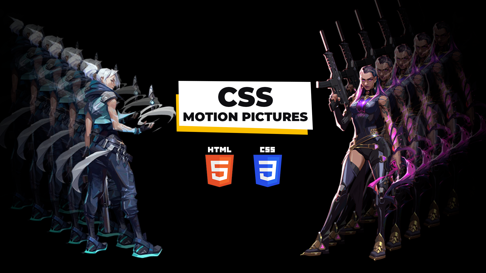

# Motion Picture Animation Effects Using HTML CSS | Valorant Motion Picture Animation

The Motion Picture Animation Effects, crafted with HTML and CSS, and possibly enhanced with JavaScript, bring cinematic dynamism to a website, reminiscent of the captivating animations found in Valorant. These effects utilize HTML for structure, CSS for styling, and potentially JavaScript for additional interactivity. Inspired by Valorant's dynamic motion pictures, this animation technique introduces visually striking and immersive transitions, possibly including smooth transitions, parallax effects, or creative motion graphics. It is commonly applied to enhance the visual storytelling on a website, providing an engaging and modern user experience. The Valorant Motion Picture Animation Effects combine creative design elements with technical implementation to create an impressive and memorable visual impact on website visitors.

